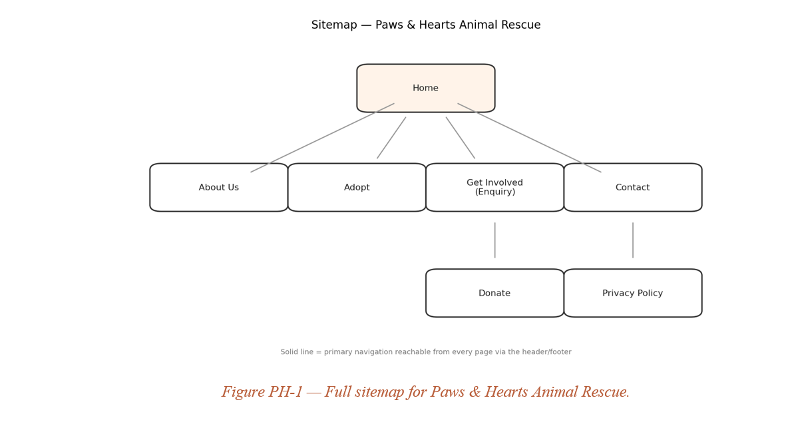

# pawshearts
# Paws & Hearts Animal Rescue — Website Build

**Student:** Nthakgeng Mosana
**Student Number:** ST10495862
**Module:** Web Development — Proof of Evidence (PoE)

---

## What This Is

Paws & Hearts Animal Rescue is a fictional Johannesburg-based non-profit, created for the purposes of this module's PoE. It started in 2021 as a handful of volunteers fostering animals from their own homes and now runs a small shelter caring for 30–40 animals at any given time. This repository holds the multi-page site built for the organisation across the three PoE milestones — a public-facing site aimed primarily at people ready to adopt, with donors and prospective volunteers as a secondary audience.

The build follows the standard three-stage PoE structure: markup first, then presentation, then behaviour.

| Stage | Focus | Status |
|---|---|---|
| Part 1 | Semantic HTML structure, accessible forms | Complete |
| Part 2 | External stylesheet, responsive layout, design tokens | Complete |
| Part 3 | Client-side interactivity, dynamic filtering | Upcoming |

---

## Site Pages

| File | Purpose |
|---|---|
| `index.html` | Home — hero banner, mission statement, featured animals |
| `about.html` | Our story, mission and vision, how the rescue process works, values |
| `adopt.html` | Full photo grid of every animal currently available for adoption |
| `enquiry.html` | Single enquiry form covering adoption, volunteering and donation interest |
| `contact.html` | Shelter and drop-off addresses, opening hours, contact form |

---

## Design Direction

- **Palette:** warm charcoal, cream and golden-tan tones, built off dog- and shelter-inspired colours rather than a clinical/corporate feel.
- **Type:** a serif display face (Fraunces) for headings paired with a plain sans-serif (DM Sans) for body text, for warmth without sacrificing legibility.
- **Layout:** image-led and mobile-first — the animals do most of the persuading, and most visitors are expected to be on a phone.

---

## Technical Notes

### Part 1 — Structure
- Semantic landmarks throughout: `<header>`, `<nav>`, `<main>`, `<section>`, `<article>`, `<footer>`.
- Accessible forms on the Enquiry and Contact pages, built with `<fieldset>`, `<legend>` and correctly associated `<label>` elements.
- A single navigation structure repeated identically across all five pages, with `aria-current="page"` marking the active link.

### Part 2 — Styling and Responsiveness
- One external stylesheet (`css/style.css`) linked from every page — no inline or embedded styles.
- A full CSS reset plus a `:root` design-token system: colour variables, a type scale, a spacing scale and shared shadow/radius values.
- Layout built with CSS Grid and Flexbox (hero section, animal card grids, footer columns, forms).
- Interactive states handled with `:hover`, `:focus`, `:active` and `:focus-visible`, including visible keyboard focus rings for accessibility.
- Two responsive breakpoints (900px tablet, 600px mobile), each adjusting layout, navigation, and typography sizing independently rather than relying on fluid sizing alone.
- Responsive images implemented with `srcset` and `sizes` attributes on every animal photo and the hero image.
- `prefers-reduced-motion` respected site-wide by disabling transitions for users who have that OS setting enabled.

### Part 3 — Planned
- Dynamic filtering on the Adopt page (species/age).
- Live validation feedback on the Enquiry and Contact forms.

---

## Changelog

**Part 1 — 1 to 14 August 2026**
- Built the static HTML skeleton for all five pages.
- Structured the Enquiry and Contact forms with semantic fieldsets and labels.
- Set up the repository folder structure (`css/`, `images/`, `js/`).

**Part 2 — 14 August to 18 September 2026**
- Addressed Part 1 feedback: tightened up heading hierarchy and improved alt-text descriptiveness across all animal images.
- Created the external stylesheet and linked it across every page.
- Established the design-token system (colour, type, spacing) in `:root`.
- Built out Grid/Flexbox layouts for the hero, animal cards, forms and footer.
- Added hover, focus and active states to all interactive elements.
- Implemented the 900px and 600px responsive breakpoints, including breakpoint-specific typography adjustments.
- Added `srcset`/`sizes` to all content images for responsive image loading.
- Verified colour contrast against WCAG 2.2 AA before finalising the palette.

---

## Site Map

---

## References

### Part 1 References

Dog Breed Info, n.d. Siberian Husky standing. [electronic print] Available at: <http://www.dogbreedinfo.com/images16/SiberianHuskySidStand.jpg> [Accessed 18 September 2026].

Flickr, 2010. Rescued dog portrait. [electronic print] Available at: <https://live.staticflickr.com/4089/4972293474_033a8cb7bf_b.jpg> [Accessed 18 September 2026].

Flickr, 2008. Rescued dog close-up. [electronic print] Available at: <https://live.staticflickr.com/3139/2930489477_5a38ccf76c.jpg> [Accessed 18 September 2026].

Flickr, 2009. Rescued cat. [electronic print] Available at: <http://farm4.static.flickr.com/3322/3270108149_67c377d0b5.jpg?v=0> [Accessed 18 September 2026].

Particlenews, n.d. Max the dog. [electronic print] Available at: <https://img.particlenews.com/image.php?type=thumbnail_580x000&url=4OaixM_0ttptZZ000> [Accessed 18 September 2026].

Flickr, 2009. Old cat. [electronic print] Available at: <https://live.staticflickr.com/2674/4187420193_e15e2baa9d.jpg> [Accessed 18 September 2026].

Flickr, 2012. Red nose pitbull. [electronic print] Available at: <https://live.staticflickr.com/7005/6695554957_99e54ee64f_b.jpg> [Accessed 18 September 2026].

Flickr, 2017. Bobcat in nature. [electronic print] Available at: <https://live.staticflickr.com/4546/26610284759_c7f116d316_b.jpg> [Accessed 18 September 2026].

Afrihost, 2026. Web hosting plans. [online] Available at: <https://www.afrihost.com> [Accessed 10 August 2026].

Google Fonts, 2026. Google Fonts. [online] Available at: <https://fonts.google.com> [Accessed 10 August 2026].

Nielsen Norman Group, 2020. Low-fidelity vs. high-fidelity prototyping. [online] Available at: <https://www.nngroup.com> [Accessed 10 August 2026].

TEARS Animal Rescue, 2026. Adopt a pet. [online] Available at: <https://tears.org.za> [Accessed 10 August 2026].

W3C, 2023. Web Content Accessibility Guidelines (WCAG) 2.2. [online] Available at: <https://www.w3.org/TR/WCAG22/> [Accessed 10 August 2026].

W3Schools, 2026. HTML semantic elements. [online] Available at: <https://www.w3schools.com/html/html5_semantic_elements.asp> [Accessed 10 August 2026].

### Part 2 References

Mozilla Corporation, n.d. CSS flexible box layout. [online] Available at: <https://developer.mozilla.org/en-US/docs/Web/CSS/CSS_flexible_box_layout> [Accessed 15 September 2026].

Mozilla Corporation, n.d. CSS Grid Layout. [online] Available at: <https://developer.mozilla.org/en-US/docs/Web/CSS/CSS_grid_layout> [Accessed 15 September 2026].

Mozilla Corporation, n.d. Using CSS custom properties (variables). [online] Available at: <https://developer.mozilla.org/en-US/docs/Web/CSS/Using_CSS_custom_properties> [Accessed 15 September 2026].

Mozilla Corporation, n.d. Using media queries. [online] Available at: <https://developer.mozilla.org/en-US/docs/Web/CSS/CSS_media_queries/Using_media_queries> [Accessed 15 September 2026].

Mozilla Corporation, n.d. Responsive images. [online] Available at: <https://developer.mozilla.org/en-US/docs/Learn/HTML/Multimedia_and_embedding/Responsive_images> [Accessed 15 September 2026].
